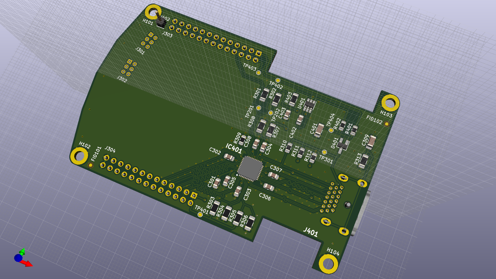
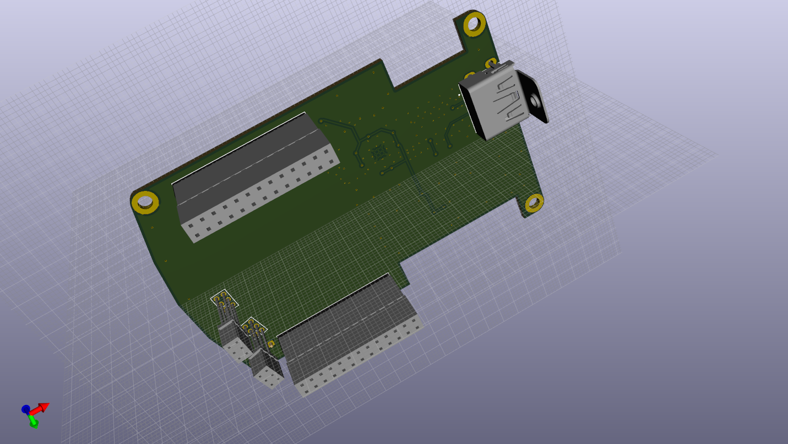
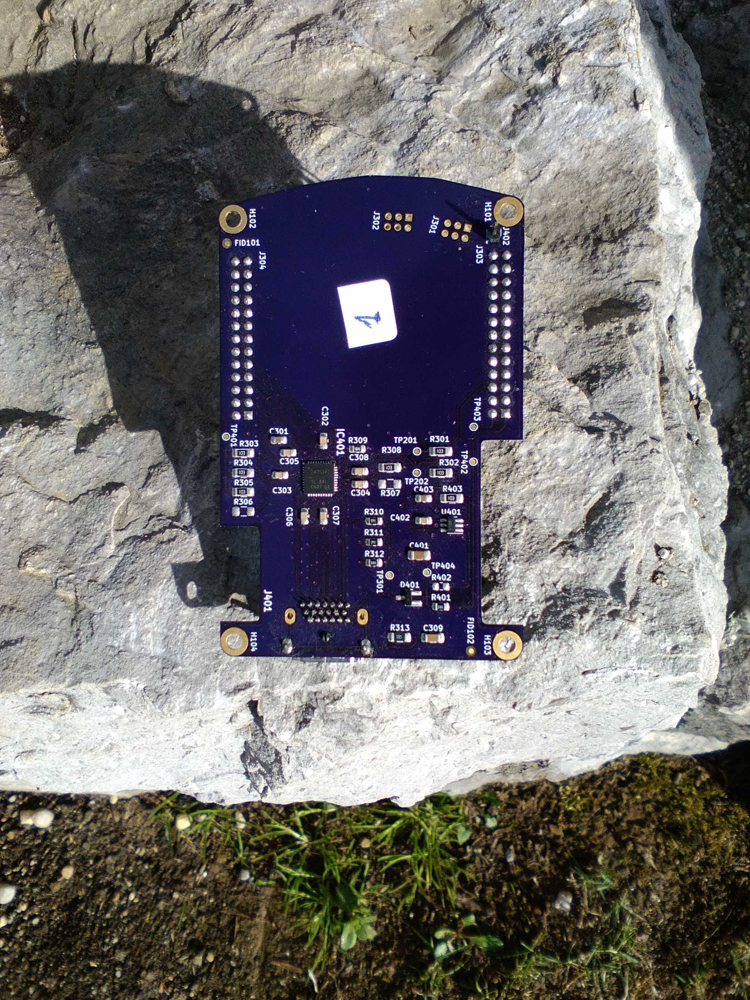

**Work in progress ...**  

---
### PCB top view:
  

---
### PCB bottom view:
  

---
### PCB components placement notes:

**NOTE:** Do not place ```R307``` and ```R306```.  
**NOTE:** Place ```R401``` or ```R402``` (power source select).  

---
### PCB placed board:
  

---

